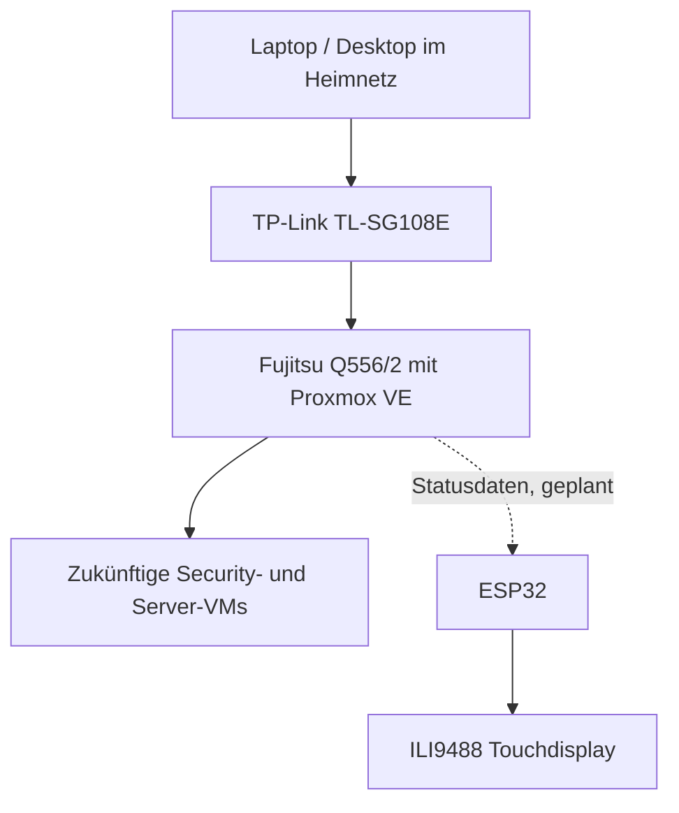

---

## Finaler Projektstand

> **Status: Build abgeschlossen**  
> Der physische Aufbau, die Netzwerkverkabelung, Proxmox VE sowie das ESP32-Touchdisplay sind eingerichtet und erfolgreich getestet.

### Ergebnis

Aus einem gebrauchten Fujitsu Esprimo Q556/2 entstand ein kompakter, transportabler 10-Zoll-Homelab-Server. Das Rack wurde passend zu den vorhandenen Komponenten konstruiert, auf einem Bambu Lab A1 Mini gedruckt und im schwarz-roten Design aufgebaut.

Der aktuelle Stand umfasst:

- einen funktionsfähigen Proxmox-Host für virtuelle Maschinen und zukünftige Security-Labs
- einen verwaltbaren Gigabit-Switch für spätere VLAN- und Segmentierungsübungen
- ein Keystone-Patchpanel mit kurzen roten Patchkabeln
- ein selbst konstruiertes Rack-Mount für den Fujitsu und den Switch
- ein ESP32-gesteuertes 3,5-Zoll-Touchdisplay zur späteren Anzeige von Statusdaten

### Abschlussfotos

  
  

  

### Aufbau

| Ebene | Komponente | Aufgabe |
|---|---|---|
| Oben | ESP32 mit 3,5-Zoll-ILI9488-Touchdisplay | Lokale Statusanzeige und Touch-Eingabe |
| Darunter | 8-Port-Keystone-Patchpanel | Saubere Kabelführung an der Front |
| Mitte | Belüftete Zwischenblende | Abstand, Luftstrom und optische Trennung |
| Darunter | TP-Link TL-SG108E | Verwaltbares Gigabit-Netzwerk |
| Unten | Fujitsu Esprimo Q556/2 | Proxmox-Host und zentrale Rechenplattform |

### Hardware

| Komponente | Ausführung |
|---|---|
| Server | Fujitsu Esprimo Q556/2 |
| Prozessor | Intel Core i5-6500T, 4 Kerne |
| Arbeitsspeicher | 16 GB DDR4 SO-DIMM |
| Speicher | 512 GB SATA-SSD |
| Netzwerk | TP-Link TL-SG108E, 8-Port Gigabit Easy Smart Switch |
| Anzeige | 3,5-Zoll-TFT, ILI9488, 480 x 320 Pixel |
| Controller | ESP32 |
| Gehäuse | Selbst gedrucktes 10-Zoll-Mini-Rack |
| Verkabelung | RJ45-Keystones und kurze Cat-6-Patchkabel |

> **RAM-Hinweis:** Der Fujitsu arbeitet derzeit stabil mit 16 GB. Ein zusätzlich bestelltes ECC-SO-DIMM war mit dem Q556/2 nicht kompatibel und wurde zurückgegeben. Für eine spätere Erweiterung auf 32 GB wird ein passendes 16-GB-DDR4-SO-DIMM ohne ECC benötigt.

### Softwarestand

- BIOS aktualisiert und Grundeinstellungen geprüft
- Hardware unter Windows vollständig getestet
- Proxmox VE installiert und als Hypervisor eingerichtet
- Netzwerkverbindung mit 1 Gbit/s erfolgreich geprüft
- ESP32-Firmware für Display- und Touchtest erstellt
- Bildausgabe und Touch-Koordinaten am eingebauten Display erfolgreich verifiziert

## ESP32- und Display-Verdrahtung

Display und Touchcontroller verwenden denselben SPI-Bus. Sie besitzen jedoch getrennte Chip-Select-Leitungen und können dadurch gezielt angesprochen werden.

### Stromversorgung und Beleuchtung

| Display-Pin | ESP32-Pin | Funktion |
|---|---|---|
| `VCC` | `5V / VIN` | Hauptstromversorgung des Displaymoduls |
| `GND` | `GND` | Gemeinsame Masse |
| `LED / BL` | `3V3` | Hintergrundbeleuchtung |

### Display

| Display-Pin | ESP32-Pin | Funktion |
|---|---|---|
| `CS` | `GPIO 27` | Chip Select des Displays |
| `RESET / RST` | `GPIO 26` | Reset-Leitung |
| `DC / RS` | `GPIO 25` | Data/Command-Auswahl |
| `SDI / MOSI` | `GPIO 23` | SPI-Datenleitung zum Display |
| `SCK / CLK` | `GPIO 18` | SPI-Takt |
| `SDO / MISO` | nicht verbunden | In diesem Aufbau bewusst frei gelassen, da die Verbindung den gemeinsam genutzten SPI-Bus störte |

### Touchcontroller

| Touch-Pin | ESP32-Pin | Funktion |
|---|---|---|
| `T_CLK` | `GPIO 18` | Gemeinsamer SPI-Takt |
| `T_CS` | `GPIO 33` | Chip Select des Touchcontrollers |
| `T_DIN / T_IN` | `GPIO 23` | Gemeinsame MOSI-Leitung |
| `T_OUT / T_DO` | `GPIO 19` | MISO-Leitung vom Touchcontroller |
| `T_IRQ` | `GPIO 32` | Touch-Interrupt für spätere Nutzung |

> Die Beschriftung `T_OUT` auf diesem Modul entspricht dem in vielen Anleitungen verwendeten Anschluss `T_DO`.

## Tests und Abnahme

| Test | Ergebnis |
|---|---|
| BIOS-Update und Hardwareerkennung | Bestanden |
| CPU-Stresstest | Bestanden, Temperatur blieb unter 70 °C |
| 16 GB Arbeitsspeicher | Vollständig erkannt |
| 512-GB-SSD | Erkannt und funktionsfähig |
| Ethernet-Link | 1 Gbit/s |
| Internet- und DNS-Verbindung | Bestanden |
| Proxmox-Installation | Erfolgreich |
| ILI9488-Bildausgabe | Erfolgreich |
| Touch-Eingabe und Koordinaten | Erfolgreich |
| Einbau und Kabelführung | Abgeschlossen |

## Eigene Arbeit und Lernergebnisse

Der Aufbau bestand nicht nur aus dem Zusammenstecken fertiger Komponenten. Mehrere Teile mussten vermessen, angepasst, testweise gedruckt und neu konstruiert werden. Dazu gehörten insbesondere die Rack-Mounts für den Fujitsu und den Switch, die Höhenaufteilung des Racks, das Patchpanel sowie die Frontplatte für das Display.

Dabei wurden unter anderem folgende praktische Erfahrungen gesammelt:

- Auswahl und Prüfung gebrauchter Serverhardware
- BIOS-Update, Hardwarediagnose und Temperaturtests
- Erkennen von ECC- und Non-ECC-RAM sowie Kompatibilitätsprüfung
- Installation und Grundkonfiguration eines Typ-1-Hypervisors
- strukturierte Netzwerkverkabelung mit Switch, Patchpanel und Keystones
- Maßaufnahme, Prototyping und Optimierung von 3D-Druckteilen
- SPI-Verkabelung und gemeinsamer Busbetrieb von Display und Touchcontroller
- Fehlersuche bei Pinbezeichnungen, MISO-Leitungen und mechanischen Toleranzen
- saubere technische Dokumentation eines vollständigen Projekts

## Nächste Ausbaustufen

Der Hardwareaufbau ist abgeschlossen. Als nächste Schritte sind vorgesehen:

- Management-IP und Netzwerkplan sauber dokumentieren
- VLANs für Management, Server, Clients und isolierte Security-Labs einrichten
- erste Linux- und Windows-VMs in Proxmox anlegen
- Logging und Monitoring aufbauen
- Statusdaten des Proxmox-Hosts an den ESP32 übertragen
- Displayansicht für Temperatur, CPU-, RAM- und Netzwerkauslastung entwickeln
- Backup- und Wiederherstellungskonzept testen

## Sicherheits- und Dokumentationshinweis

Öffentlich dokumentiert werden nur Architektur, Lernziele und nicht sensible Konfigurationsbeispiele. Interne IP-Adressen, Zugangsdaten, Tokens, Schlüssel und andere Geheimnisse gehören nicht in dieses Repository.

