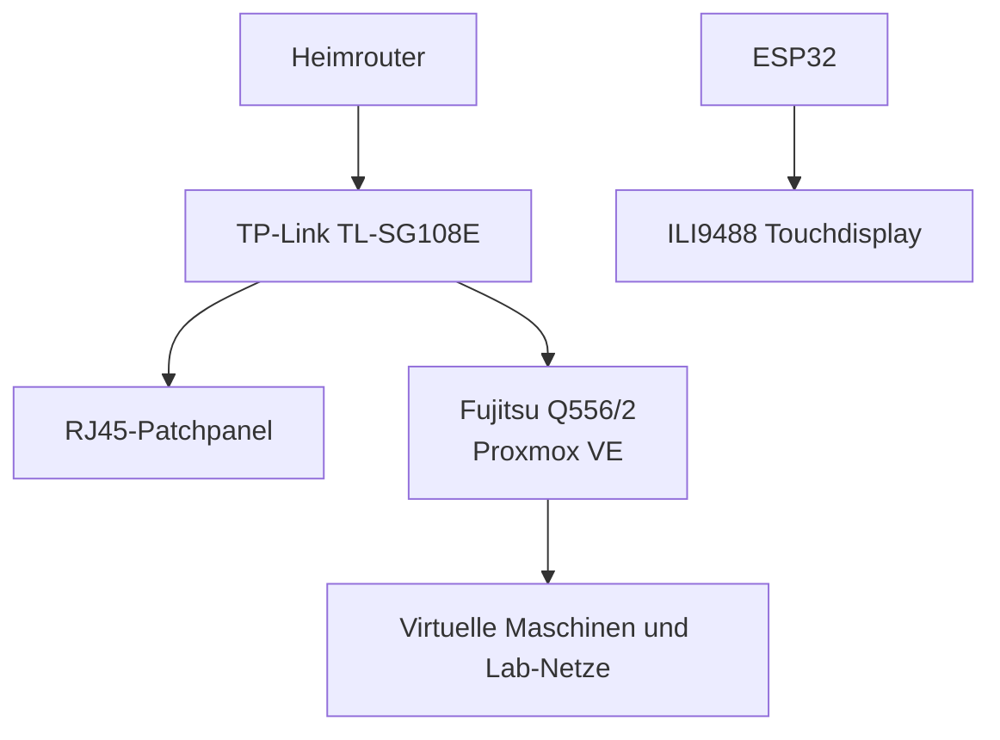

## Finaler Projektstand

Der physische Aufbau und die Grundinstallation des Homelabs sind abgeschlossen. Das System ist als kompakte, transportable 10-Zoll-Laborplattform fuer Virtualisierung, Netzwerke und Cybersecurity-Uebungen ausgelegt.

### Ergebnis

- Individuelles 10-Zoll-Rack konstruiert, angepasst und auf einem Bambu Lab A1 Mini gedruckt
- Fujitsu Esprimo Q556/2 sicher im Rack montiert
- TP-Link TL-SG108E und acht RJ45-Keystones sauber in die Front integriert
- ESP32 mit 3,5-Zoll-Touchdisplay verdrahtet, getestet und eingebaut
- Proxmox VE installiert und als Virtualisierungsbasis eingerichtet
- BIOS, Temperatur, Arbeitsspeicher, SSD und Gigabit-Ethernet erfolgreich geprueft

### Fertiger Aufbau

| Frontansicht | Perspektive |
|---|---|
|  |  |

### Hardware

| Komponente | Ausfuehrung |
|---|---|
| Host | Fujitsu Esprimo Q556/2 |
| Prozessor | Intel Core i5-6500T |
| Arbeitsspeicher | 16 GB DDR4 SO-DIMM |
| Datentraeger | 512 GB SATA-SSD |
| Switch | TP-Link TL-SG108E, 8-Port Gigabit Easy Smart Switch |
| Patchpanel | 8 RJ45-Keystone-Kupplungen mit kurzen roten Cat-6-Patchkabeln |
| Anzeige | 3,5-Zoll ILI9488 TFT, 480 x 320 Pixel, resistiver Touch |
| Controller | ESP32 |
| Gehaeuse | Eigenes 3D-gedrucktes 10-Zoll-Rack in Schwarz und Rot |

> Der Host laeuft derzeit bewusst mit 16 GB RAM. Eine Erweiterung erfolgt erst mit einem sicher kompatiblen Non-ECC-Modul.

### Software und Architektur

- Proxmox VE ist installiert und bildet die Basis fuer virtuelle Maschinen und isolierte Testnetze.
- Der ESP32 steuert das Frontdisplay unabhaengig vom Host.
- Display und Touch verwenden denselben SPI-Bus mit getrennten Chip-Select-Leitungen.
- Der Managed Switch ermoeglicht spaetere VLAN- und Segmentierungsuebungen.

### ESP32- und Display-Verdrahtung

#### Stromversorgung

| Display-Pin | ESP32-Pin | Funktion |
|---|---|---|
| VCC | 5V / VIN | Versorgung des Displays |
| GND | GND | Gemeinsame Masse |
| LED / BL | 3V3 | Hintergrundbeleuchtung |

#### Bildausgabe

| Display-Pin | ESP32-Pin | Funktion |
|---|---|---|
| CS | GPIO 27 | Chip Select des Displays |
| RESET / RST | GPIO 26 | Reset |
| DC / RS | GPIO 25 | Data / Command |
| SDI / MOSI | GPIO 23 | SPI-Daten zum Display |
| SCK / CLK | GPIO 18 | SPI-Takt |
| SDO / MISO | Nicht verbunden | Blieb frei, da die Verbindung den gemeinsam genutzten SPI-Bus stoerte |

#### Touchscreen

| Touch-Pin | ESP32-Pin | Funktion |
|---|---|---|
| T_CLK | GPIO 18 | Gemeinsamer SPI-Takt |
| T_CS | GPIO 33 | Chip Select des Touchcontrollers |
| T_DIN / T_IN | GPIO 23 | Gemeinsame MOSI-Leitung |
| T_OUT / T_DO | GPIO 19 | MISO vom Touchcontroller |
| T_IRQ | GPIO 32 | Touch-Interrupt |

### Verifikation

| Test | Ergebnis |
|---|---|
| BIOS aktualisiert | Erfolgreich |
| CPU-Stresstest | Maximaltemperatur unter 70 Grad C |
| Arbeitsspeicher und SSD | Ohne Auffaelligkeiten |
| Ethernet-Link | 1 Gbit/s |
| Displayausgabe | Erfolgreich |
| Touch-Eingabe | Koordinaten werden korrekt erkannt |
| Proxmox VE | Installiert und erreichbar |

### Eigenleistung und Lerngewinn

- Gebrauchte Hardware ausgewaehlt, geprueft und fuer den Laboreinsatz vorbereitet
- Rack-Aufteilung geplant und mehrere passgenaue Halterungen iterativ konstruiert
- Druckteile auf die begrenzte Bauflaeche des A1 Mini angepasst
- Patchpanel, Switch, Host, Display und Verkabelung montiert
- SPI-Verdrahtung analysiert und einen Buskonflikt systematisch behoben
- Proxmox als Virtualisierungsplattform eingerichtet
- Den vollstaendigen Aufbau nachvollziehbar dokumentiert

### Naechste Schritte

1. Management-Zugaenge absichern und Konfigurationen sichern
2. VLANs fuer Management, Server, Clients und Angriffslabor aufbauen
3. Erste VMs fuer Monitoring, Windows/Linux-Administration und Security-Tests bereitstellen
4. Statusdaten des Proxmox-Hosts ueber eine kleine API an das ESP32-Display uebertragen
5. Netzwerkdiagramme, Konfigurationsauszuege und Lab-Reports in den vorgesehenen Portfolio-Ordnern ergaenzen

> In der oeffentlichen Dokumentation werden keine Passwoerter, privaten IP-Adressen, Tokens, Seriennummern oder vollstaendigen Konfigurationssicherungen veroeffentlicht.
