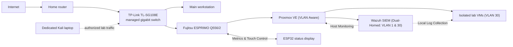
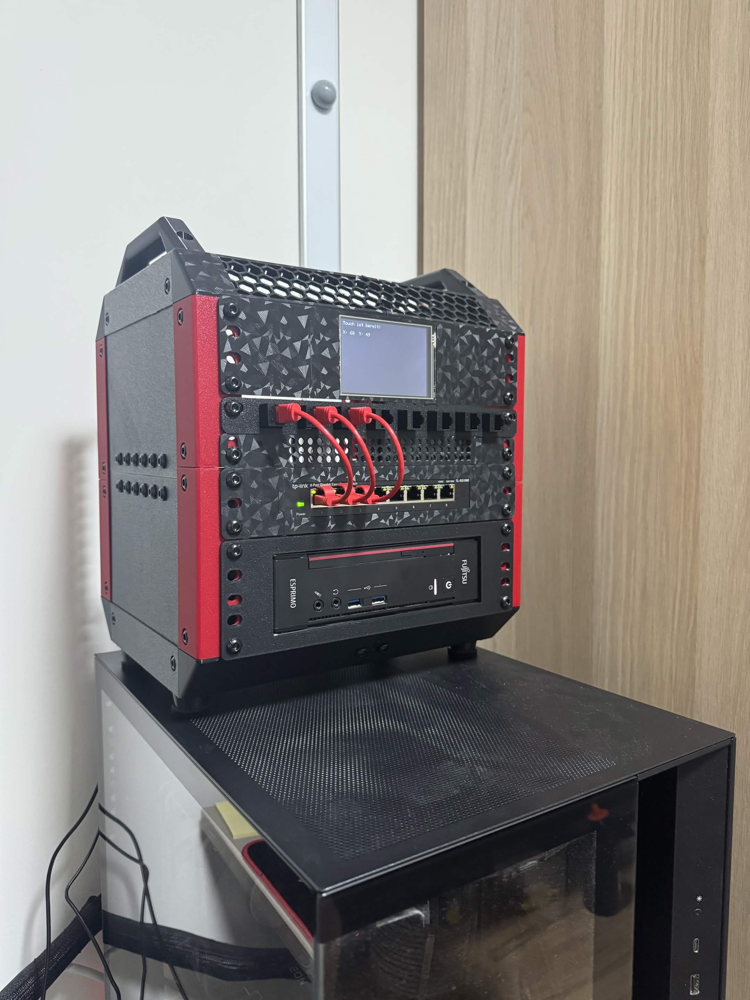

# Budget Cybersecurity Homelab

## Project Goal

Build a compact, reliable, and affordable environment for learning virtualization,
networking, system hardening, security monitoring, and authorized penetration
testing. The physical system is designed as a custom 3D-printed 10-inch rack that can be
expanded modularly.

## Current Architecture

> **Security & Privacy Note:** No public IP addresses, internal production addresses, MAC addresses, serial numbers, or credentials are included in this repository.

## Hardware Specifications

| Component | Specification | Status |
| --- | --- | --- |
| **Server** | Fujitsu ESPRIMO Q556/2 (USFF) | Active |
| **CPU** | Intel Core i5-6500T (4 cores / 4 threads @ 2.50 GHz, boost to 3.10 GHz) | Active |
| **Memory** | 32 GB DDR4 SO-DIMM (Non-ECC) | Active |
| **Storage** | 512 GB SATA SSD | Active |
| **Network** | Integrated Realtek Gigabit Ethernet | Active |
| **Switch** | TP-Link TL-SG108E, 8-Port Managed Gigabit | Active (802.1Q VLAN) |
| **Front I/O** | 8-Port Cat 6 Keystone Patch Panel with slim patch cables | Active |
| **Status Display** | ESP32 with 3.5-inch ILI9488 SPI Touchscreen | Active ([Wiring Reference](esp32-ili9488-wiring.md)) |
| **Rack Enclosure** | Custom 10-inch rack printed on Bambu Lab A1 Mini | Completed |

## Hardware Validation & Benchmarking

- [x] **BIOS Updated:** Flashed to latest revision R1.35.0.
- [x] **Component Detection:** CPU, RAM, and SSD detected and validated with zero memory errors.
- [x] **RAM Upgrade:** Upgraded from 16 GB to 32 GB DDR4 SO-DIMM (Non-ECC); stress-tested for stability.
- [x] **Virtualization:** Intel VT-x and VT-d hardware virtualization verified in BIOS and Proxmox.
- [x] **Network Negotiation:** Gigabit Ethernet negotiated at full 1 Gbit/s full-duplex without packet loss.
- [x] **Thermal Performance:** CPU temperatures remained safely under 70°C during extended synthetic load testing.
- [x] **Touch Display Integration:** ESP32 communicates with Proxmox VE API via a lightweight Node.js/PM2 LXC middleware (75 MB RAM footprint) for real-time CPU/memory graphs and VM power toggles.

## Physical Measurements & 3D Print Design

| Dimension | Measurement |
| --- | ---: |
| Width | 185 mm |
| Depth | 190 mm |
| Height | 55 mm |

The custom 1.5U mount supports 160 mm of chassis depth. Approximately 30 mm extends beyond the rear of the open 10-inch frame for optimal cable clearance and passive airflow.

## Build Status & Roadmap

### Phase 1: Foundation (Completed)
- [x] Source, inspect, and benchmark the Fujitsu ESPRIMO Q556/2
- [x] Validate CPU, RAM, SSD, and gigabit networking
- [x] Update BIOS and configure virtualization settings
- [x] Measure chassis and model 1.5U rack mount in OpenSCAD
- [x] Print fit-test piece and complete full 10-inch rack print on Bambu Lab A1 Mini
- [x] Integrate TP-Link TL-SG108E switch and keystone patch panel
- [x] Install and harden Proxmox VE
- [x] Build isolated security lab network (VLAN 30)
- [x] Assemble and wire ESP32 + ILI9488 SPI touch status display

### Phase 2: Blue Teaming & Security Monitoring (In Progress)
- [x] Deploy Wazuh SIEM manager for centralized logging and telemetry
  - [x] Configure dual-homed network architecture (VLAN 1 management + VLAN 30 lab) with no default gateway on VLAN 30
  - [x] Deploy Wazuh Agent via air-gapped/offline transfer (`scp` + `dpkg`) to isolated OWASP Juice Shop target VM
  - [x] Deploy Wazuh Agent directly on Proxmox Hypervisor for File Integrity Monitoring (FIM) and authentication auditing
- [ ] Build Windows Active Directory lab environment (Windows Server DC + Windows 11 client)
- [ ] Execute attack simulations (credential stuffing, brute-force, web exploits) and build custom Wazuh detection rules

## Hardware Gallery

| Front View | Angled View | Side Profile |
| :---: | :---: | :---: |
|  |  |  |

---

## Detailed Notes & Wiring

- **Chronological Build Log:** [Homelab_Logbuch.md](Homelab_Logbuch.md)
- **ESP32 Display Wiring Pinout:** [esp32-ili9488-wiring.md](esp32-ili9488-wiring.md)