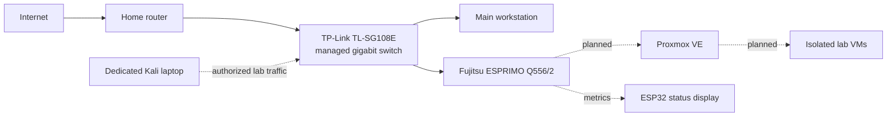

# Budget Cybersecurity Homelab

## Project Goal

Build a compact and affordable environment for learning virtualization,
networking, system hardening, security monitoring and authorized penetration
testing. The physical system is designed as a custom 10-inch rack that can be
expanded gradually.

## Current Architecture



No public IP addresses, internal addresses, MAC addresses, serial numbers or
credentials are included in this repository.

## Hardware

| Component | Specification | Status |
| --- | --- | --- |
| Server | Fujitsu ESPRIMO Q556/2 | Tested |
| CPU | Intel Core i5-6500T, 4 cores / 4 threads | Tested |
| Memory | 16 GB DDR4-2133, one free slot | Tested |
| Storage | 512 GB SATA SSD | Tested |
| Network | Integrated gigabit Ethernet | Tested |
| Switch | TP-Link TL-SG108E, 8-port managed gigabit | Acquired |
| Display | ESP32 with 3.5-inch ILI9488 SPI display | Planned |
| Rack | Custom 3D-printed 10-inch rack | In progress |

## Hardware Validation

- BIOS updated successfully
- CPU, memory and storage detected correctly
- Hardware virtualization enabled
- Gigabit Ethernet negotiated successfully
- IPv4 and IPv6 connectivity tested without packet loss
- Memory, storage and stability tests completed without errors
- CPU remained below 70 degrees Celsius during the stress test

## Physical Measurements

| Dimension | Measurement |
| --- | ---: |
| Width | 185 mm |
| Depth | 190 mm |
| Height | 55 mm |

The custom 1.5U mount supports 160 mm of the chassis depth. Approximately
30 mm intentionally extends beyond the rear of the open rack.

## Build Status

- [x] Source and inspect the server
- [x] Validate CPU, RAM, SSD and networking
- [x] Update the BIOS
- [x] Measure the chassis
- [x] Design the first custom rack-mount revision
- [ ] Print and validate a short fit-test section
- [ ] Print and assemble the final rack mount
- [ ] Integrate the managed switch
- [ ] Integrate the ESP32 status display
- [ ] Install and harden Proxmox
- [ ] Build the first isolated security lab

Detailed chronological notes are available in
[Homelab_Logbuch.md](Homelab_Logbuch.md).

# Proxmox VE Installation & Initial Setup

## Overview
As part of the physical homelab build, this document details the installation of the Proxmox Virtual Environment (VE) on the primary host, a Fujitsu ESPRIMO Q556/2. This hypervisor serves as the foundation for all isolated lab networks, security monitoring tools, and vulnerable target VMs required for the HTB Academy labs.

## Prerequisites & Pre-Installation Validation
Before initiating the installation, the following hardware validations were successfully completed:
*   **BIOS:** Updated successfully.
*   **Hardware Virtualization:** Enabled (Intel VT-x / VT-d active).
*   **Storage:** 512 GB SATA SSD detected correctly and formatted.
*   **Installation Media:** Bootable USB drive prepared with the latest Proxmox VE ISO using a DD-mode flashing tool.

## Installation Steps (Base System)

1.  **Boot Configuration:** 
    *   Inserted the Proxmox USB installer into the ESPRIMO host.
    *   Accessed the boot menu and selected the USB drive.
2.  **Proxmox Installer:**
    *   Selected **Install Proxmox VE** from the GRUB menu.
    *   Accepted the EULA and selected the internal 512 GB SATA SSD as the target disk (Ext4 filesystem default).
3.  **Localization & Credentials:**
    *   Configured country, time zone, and keyboard layout.
    *   Set a strong `root` password (stored securely offline) and provided a valid administrative email address.
4.  **Network Configuration:**
    *   Selected the integrated gigabit Ethernet interface.
    *   Assigned a static internal IPv4 address outside the router's DHCP scope to ensure reliable access.
    *   Configured the default gateway and DNS server (pointing to the home router).
5.  **Finalization:**
    *   Completed the installation and removed the USB drive upon reboot.
    *   Verified access to the Proxmox web GUI via `https://<STATIC-IP>:8006`.

## Next Steps (Hardening & Configuration)
*   Disable the enterprise repository and enable the "No-Subscription" community repository.
*   Update the Proxmox base system (`apt update && apt dist-upgrade`).
*   Deploy the first LXC container to act as the TypeScript middleware for the ESP32 status display.

<!-- FINAL_BUILD_2026 -->
## Finaler Projektstand


> **Status:** Hardwareaufbau, Netzwerk, Proxmox-Host sowie ESP32-Display mit Touch-Funktion sind eingerichtet und erfolgreich getestet.

Das Homelab ist als kompakte, transportable Lernplattform für Virtualisierung, Netzwerktechnik und Cybersecurity aufgebaut. Das Gehäuse und die Rack-Mounts wurden für ein 10-Zoll-Mini-Rack angepasst und überwiegend auf einem Bambu Lab A1 Mini gedruckt. Der finale Aufbau verbindet einen Proxmox-Host, einen verwaltbaren Gigabit-Switch, ein Keystone-Patchpanel und ein eigenes ESP32-Statusdisplay.

### Komponenten

| Komponente | Ausführung | Zweck |
|---|---|---|
| Compute Node | Fujitsu Esprimo Q556/2, Intel Core i5-6500T | Proxmox-Host und virtuelle Lab-Systeme |
| Arbeitsspeicher | 16 GB DDR4 SO-DIMM | Betrieb mehrerer kleiner VMs und Container |
| Massenspeicher | 512 GB SATA-SSD | Proxmox, VM-Disks und Lab-Daten |
| Netzwerk | TP-Link TL-SG108E, 8-Port Gigabit Easy Smart Switch | Zentrale Netzwerkverteilung und spätere VLAN-Übungen |
| Patchfeld | 8-Port RJ45-Keystone-Panel | Saubere Frontverkabelung |
| Anzeige | ESP32 mit 3,5-Zoll-ILI9488-Touchscreen, 480 x 320 Pixel | Statusanzeige und lokale Bedienoberfläche |
| Rack | 3D-gedrucktes 10-Zoll-Mini-Rack | Modularer und transportabler Aufbau |

### Aufbau und Signalweg

```text
Router / Heimnetz
       |
       v
TP-Link TL-SG108E
       |
       +-- Fujitsu Esprimo Q556/2 mit Proxmox VE
       +-- Administrations-PC oder Laptop
       +-- weitere Lab-Systeme und Testgeräte

ESP32 + Touchscreen
       +-- lokale Statusanzeige
       +-- später: Proxmox- und Netzwerkmetriken
```

Die kurzen roten Cat6-Patchkabel verbinden das Keystone-Panel mit dem Switch. Dadurch bleiben die externen Anschlüsse sauber zugänglich, während die eigentliche Kabelführung im Rack verborgen ist.

### Proxmox VE

Auf dem Fujitsu wurde **Proxmox VE** als Virtualisierungsplattform installiert und grundlegend eingerichtet. Der Host bildet die Basis für isolierte Cybersecurity-Labs, beispielsweise für:

- Linux- und Windows-Testsysteme
- Netzwerk- und Firewall-Labs
- Logging, Monitoring und SIEM-Grundlagen
- bewusst verwundbare Übungsmaschinen
- spätere Active-Directory- und Incident-Response-Szenarien

Der produktive Heim-PC und das Homelab bleiben logisch getrennte Rollen: Der Fujitsu stellt die Lab-Infrastruktur bereit, während die Administration über Browser und Netzwerk erfolgt.

### ESP32-Display und Touch

Das Display wurde verkabelt, verlötet, im Rack montiert und gemeinsam mit dem Touch-Controller getestet. Bildausgabe und Touch-Eingabe funktionieren.

#### Stromversorgung

| Display-Pin | ESP32-Pin | Funktion |
|---|---|---|
| VCC | 5V / VIN | Hauptversorgung des Displaymoduls |
| GND | GND | Gemeinsame Masse |
| LED / BL | 3V3 | Hintergrundbeleuchtung |

#### Display-Signale

| Display-Pin | ESP32-Pin | Funktion |
|---|---|---|
| CS | GPIO 27 | Chip Select |
| RESET / RST | GPIO 26 | Reset |
| DC / RS | GPIO 25 | Data / Command |
| SDI / MOSI | GPIO 23 | SPI-Daten zum Display |
| SCK / CLK | GPIO 18 | SPI-Takt |
| SDO / MISO | nicht verbunden | In dieser ILI9488-Konfiguration nicht verwendet |

#### Touch-Signale

| Touch-Pin | ESP32-Pin | Funktion |
|---|---|---|
| T_CLK | GPIO 18 | Gemeinsamer SPI-Takt |
| T_CS | GPIO 33 | Chip Select des Touch-Controllers |
| T_DIN / T_IN | GPIO 23 | Gemeinsame MOSI-Leitung |
| T_OUT / T_DO | GPIO 19 | MISO vom Touch-Controller |
| T_IRQ | GPIO 32 | Touch-Interrupt für spätere Nutzung |

> **Hinweis:** Display und Touch teilen sich SCK und MOSI, verwenden aber getrennte Chip-Select-Leitungen.

### Tests und Validierung

| Test | Ergebnis |
|---|---|
| BIOS-Update | erfolgreich |
| CPU-Stresstest | stabil, maximale Temperatur unter 70 °C |
| Arbeitsspeicher und SSD | erkannt und ohne Auffälligkeiten |
| Ethernet-Link | 1 Gbit/s |
| Internet- und DNS-Test | erfolgreich |
| Proxmox-Installation | erfolgreich |
| ESP32-Bildausgabe | erfolgreich |
| Touch-Eingabe | erfolgreich |
| Mechanischer Aufbau | vollständig montiert und stabil |

### Eigendokumentation: Erkenntnisse aus dem Aufbau

Der Aufbau war nicht nur eine Montagearbeit, sondern ein vollständiger kleiner Engineering-Prozess. Besonders wichtig waren:

1. **Anforderungen messen und iterativ testen:** Rack-Mounts mussten mehrfach an reale Maße, Lochabstände und Drucktoleranzen angepasst werden.
2. **Fehler systematisch eingrenzen:** BIOS, CPU-Temperatur, RAM, SSD, Netzwerk, Display und Touch wurden getrennt getestet, bevor alles endgültig montiert wurde.
3. **Hardwarekompatibilität prüfen:** Formfaktor, ECC-Unterstützung, Speichertakt und Rank-Organisation müssen vor einem RAM-Kauf vollständig geprüft werden.
4. **SPI-Bus verstehen:** Display und Touch verwenden gemeinsame Leitungen, benötigen aber eigene Chip-Select-Signale.
5. **Dokumentation als Teil des Projekts behandeln:** Verkabelung, Tests, Entscheidungen und Ergebnisse wurden nachvollziehbar festgehalten.
6. **Saubere Infrastruktur planen:** Patchpanel, Switch und Proxmox-Host wurden so angeordnet, dass Wartung und spätere Erweiterungen möglich bleiben.

Damit sind **Hardwareaufbau und Basiskonfiguration abgeschlossen**. Das Homelab ist nun bereit für die eigentlichen Cybersecurity-Projekte und Lab-Reports.

### Nächste Ausbaustufen

- Proxmox-Netzwerk und Managementzugriff härten
- regelmäßige Backups der Proxmox-Konfiguration einrichten
- getrennte VLANs für Management, Server und Angriffslabore aufbauen
- Firewall-VM, Monitoring und zentrale Protokollierung ergänzen
- ESP32-Display mit Live-Daten wie Hoststatus, CPU-Temperatur und VM-Zuständen versorgen
- erste reproduzierbare Labs unter `02_Lab_Reports` dokumentieren

### Galerie

| Frontansicht | Seitenansicht |
|---|---|
|  |  |


