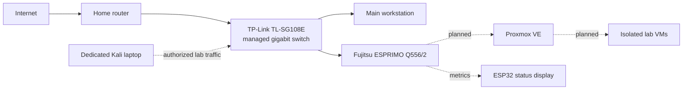

# Budget Cybersecurity Homelab

## Project Goal

Build a compact and affordable environment for learning virtualization,
networking, system hardening, security monitoring and authorized penetration
testing. The physical system is designed as a custom 10-inch rack that can be
expanded gradually.

## Current Architecture

No public IP addresses, internal addresses, MAC addresses, serial numbers or
credentials are included in this repository.

## Hardware

| Component | Specification | Status |
| --- | --- | --- |
| Server | Fujitsu ESPRIMO Q556/2 | Tested |
| CPU | Intel Core i5-6500T, 4 cores / 4 threads | Tested |
| Memory | 16 GB DDR4-2133, one free slot | Tested |
| Storage | 512 GB SATA SSD | Tested |
| Network | Integrated gigabit Ethernet | Tested |
| Switch | TP-Link TL-SG108E, 8-port managed gigabit | Acquired |
| Display | ESP32 with 3.5-inch ILI9488 SPI display | Planned |
| Rack | Custom 3D-printed 10-inch rack | In progress |

## Hardware Validation

- BIOS updated successfully
- CPU, memory and storage detected correctly
- Hardware virtualization enabled
- Gigabit Ethernet negotiated successfully
- IPv4 and IPv6 connectivity tested without packet loss
- Memory, storage and stability tests completed without errors
- CPU remained below 70 degrees Celsius during the stress test

## Physical Measurements

| Dimension | Measurement |
| --- | ---: |
| Width | 185 mm |
| Depth | 190 mm |
| Height | 55 mm |

The custom 1.5U mount supports 160 mm of the chassis depth. Approximately
30 mm intentionally extends beyond the rear of the open rack.

## Build Status

- [x] Source and inspect the server
- [x] Validate CPU, RAM, SSD and networking
- [x] Update the BIOS
- [x] Measure the chassis
- [x] Design the first custom rack-mount revision
- [ ] Print and validate a short fit-test section
- [ ] Print and assemble the final rack mount
- [ ] Integrate the managed switch
- [ ] Integrate the ESP32 status display
- [ ] Install and harden Proxmox
- [ ] Build the first isolated security lab

Detailed chronological notes are available in
[Homelab_Logbuch.md](Homelab_Logbuch.md).
