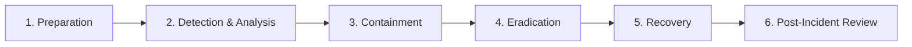

# Incident Response & SOC Reports

This directory contains structured incident response reports, threat hunting documentation, and forensic triage writeups based on simulated security incidents within the homelab environment.

The goal is to practice real-world Security Operations Center (SOC) analysis, blue teaming, alert validation, and defensive incident handling.

---

## Incident Handling Framework

All incident response documentation follows industry-standard incident handling lifecycles aligned with **NIST SP 800-61 Rev. 2** and the **SANS 6-Phase Incident Handling Process**:



1. **Preparation:** Maintaining monitoring infrastructure (Wazuh SIEM, log forwarders, baseline system configurations).
2. **Detection & Analysis:** Identifying anomalies, validating SIEM alert triggers, determining attack vectors, and scoping impact.
3. **Containment:** Short-term isolation (VLAN isolation, iptables blocks) and long-term isolation strategies.
4. **Eradication:** Removing artifacts, terminating malicious processes, patching vulnerabilities, and updating rulesets.
5. **Recovery:** Restoring services to trusted operations, monitoring for persistent backdoors, and validating system integrity.
6. **Post-Incident Review (Lessons Learned):** Documenting root cause analysis, tuning SIEM detection rules, and improving defense-in-depth controls.

---

## Incident Reports Index

| Report ID | Title | Threat Vector | Monitored Platform | Severity | Status |
| :--- | :--- | :--- | :--- | :---: | :---: |
| `IR-2026-001` | [Simulated Web Application Brute Force & Credential Stuffing](IR-2026-001_Brute_Force.md) | HTTP POST Flood / Credential Stuffing | Wazuh SIEM + Juice Shop (VLAN 30) | **Medium** | `In Progress` |
| `IR-2026-002` | Unauthorized SSH Access Attempt & FIM Alert | SSH Dictionary Attack / Config Drift | Wazuh Agent + Proxmox VE Host | **Low** | `Planned` |
| `IR-2026-003` | Active Directory Kerberoasting & Malicious Ticket Request | Kerberos TGS Abuse | Windows Server DC (Active Directory) | **High** | `Planned` |

---

## Standard Incident Response Report Template

All incident writeups follow this standardized template:

```markdown
# [IR-ID] Incident Title

**Incident Reference:** IR-YYYY-XXX  
**Date Reported:** YYYY-MM-DD HH:MM UTC  
**Incident Lead:** Darius-Simon Morariu  
**Severity Level:** Low / Medium / High / Critical  
**Current Status:** Closed / Under Investigation / Remediated  

---

## 1. Incident Overview & Impact
- **Executive Summary:** Brief summary of the event, business or lab impact, and operational status.
- **Affected Assets:** Target hostnames, internal IPs, services, and affected user accounts.
- **Initial Detection Source:** Wazuh Alert ID, syslog anomaly, firewall drop log, or user report.

## 2. Chronological Timeline
| Timestamp (UTC) | Source / System | Event Description | Action Taken |
| :--- | :--- | :--- | :--- |
| YYYY-MM-DD 14:02:11 | Kali Attacker (`10.30.0.50`) | Automated directory enumeration initiated | Monitored via Nginx log |
| YYYY-MM-DD 14:05:43 | Wazuh Manager (`10.30.0.100`) | Alert 5503: High frequency of HTTP 401 status codes | Analyst alerted |
| YYYY-MM-DD 14:08:20 | Analyst Workstation | Network isolation applied to target VM port | Incident Contained |

## 3. Threat Analysis & Indicators of Compromise (IOCs)
### Indicators of Compromise
| Type | Value / Signature | Context |
| :--- | :--- | :--- |
| IPv4 | `10.30.0.X` (Sanitized) | Attacker source address |
| SHA-256 | `e3b0c44298fc1c149afbf4c8996fb92427ae41e4649b934ca495991b7852b855` | Malicious payload / script |
| User-Agent | `sqlmap/1.7#stable` | Automated scanner signature |

### Attack Classification (MITRE ATT&CK)
- **Tactic:** Initial Access / Credential Access / Privilege Escalation
- **Technique:** e.g., T1110 (Brute Force), T1190 (Exploit Public-Facing Application)

## 4. Containment, Eradication & Recovery
- **Containment Measures:** Actions taken to stop lateral spread or data exfiltration.
- **Eradication Steps:** Removal of malicious artifacts, credential resets, and software patching.
- **Recovery & Verification:** Restoring clean state and verifying service stability.

## 5. Root Cause & Lessons Learned
- **Root Cause Analysis:** Why was the attack possible?
- **Detection Engineering Improvement:** Custom Wazuh XML rule or Suricata signature developed to catch future attempts.
- **Preventive Hardening:** System or network adjustments implemented to prevent reoccurrence.
```

---

## Telemetry & Tooling

- **SIEM:** Wazuh Manager & Indexer (dual-homed architecture across VLAN 1 & VLAN 30)
- **Host Agents:** Wazuh Agents on Proxmox VE Host and isolated Linux VMs
- **Network Captures:** Wireshark / TShark (sanitized PCAP analysis stored locally)
- **Log Correlation:** Linux auditd, systemd journal, auth.log, and web server logs