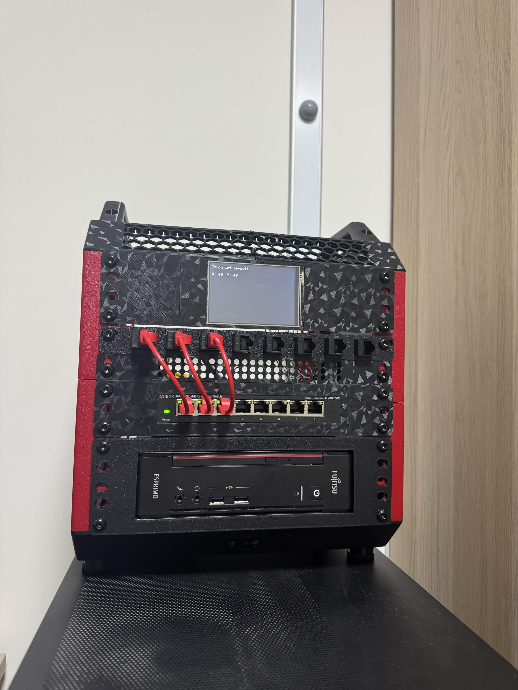
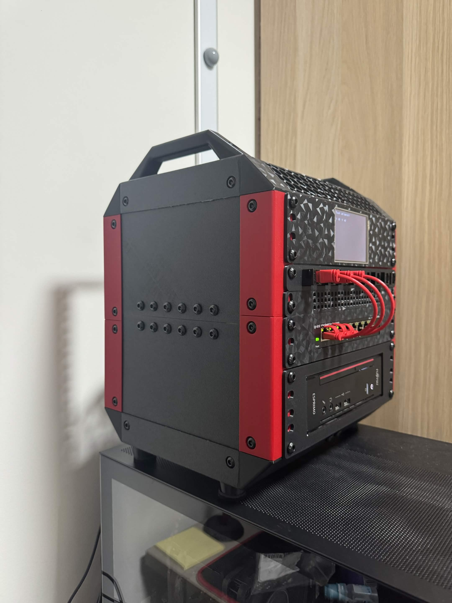

# Cybersecurity Homelab

## Overview

A compact 10-inch homelab built as a practical platform for networking,
virtualization and cybersecurity experiments. The physical build and the ESP32
touch display are complete. The software lab will be expanded in the next
phase.

## Hardware

| Component | Details |
| --- | --- |
| Host | Fujitsu Esprimo Q556/2 |
| CPU | Intel Core i5-6500T |
| Memory | 16 GB DDR4 SO-DIMM |
| Storage | 512 GB SATA SSD |
| Network | TP-Link TL-SG108E managed 8-port Gigabit switch |
| Front I/O | 8-port Cat 6 keystone patch panel |
| Display | ESP32 with 3.5-inch ILI9488 SPI touch display |
| Rack | Custom 3D-printed 10-inch rack, printed on a Bambu Lab A1 Mini |

## Completed

- Updated the BIOS and verified hardware stability.
- Kept the CPU below 70 degrees Celsius during stress testing.
- Verified a 1 Gbit/s Ethernet link.
- Designed and printed custom mounts for the Fujitsu, switch, patch panel and
  display.
- Tested display output and touch input.
- Completed front cable management with short red patch cables.

## ESP32 Wiring

Detailed wiring:
[ESP32 + ILI9488 display and touch](esp32-ili9488-wiring.md)

## Next Steps

- Install Proxmox VE.
- Configure VLANs on the managed switch.
- Create isolated VMs and containers for monitoring, attack simulation and
  vulnerable targets.
- Document each experiment, architecture decision and result.

## Gallery

